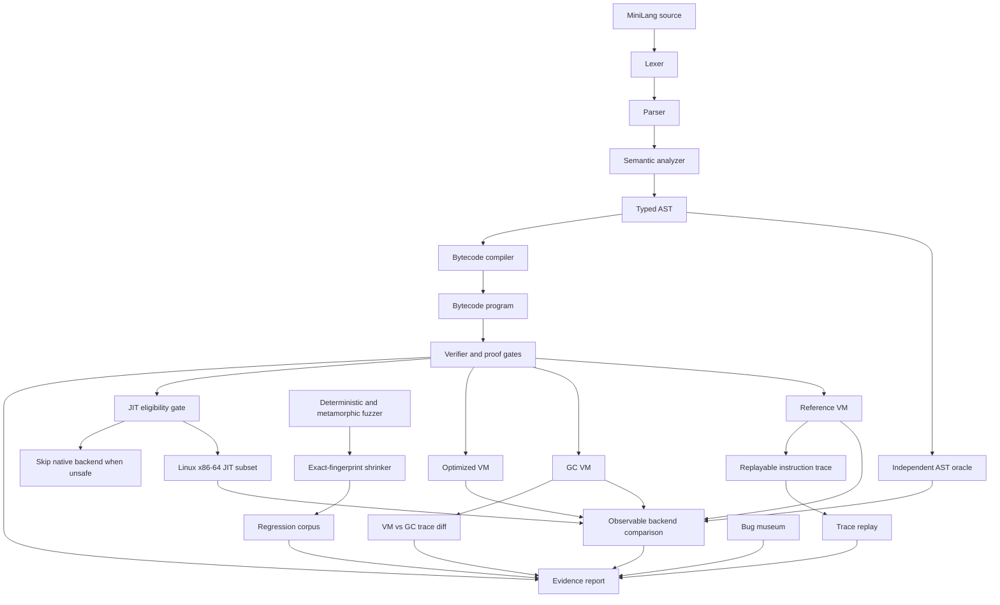

# Qydrel Architecture

Qydrel is shaped around one question: can a small compiler/runtime prove its
own behavior from several independent angles before anyone trusts an optimized
or native backend?

## Core Boundary

The source language is intentionally small. The novelty is not syntax breadth;
it is the surrounding correctness machinery:

- Independent AST execution gives a source-level oracle that does not reuse the
  bytecode VM implementation.
- The verifier decides whether bytecode is structurally valid and whether a
  backend is allowed to execute it.
- Backend comparison checks the reference VM, GC VM, optimized VM, and eligible
  JIT path against the same observable result.
- Trace replay and VM/GC trace diff catch runtime-level divergence that plain
  output comparison can miss.
- Fuzzing, metamorphic variants, shrinking, corpus replay, and bug-museum tests
  turn discovered failures into durable evidence.

## Trust Model

Qydrel does not claim a formal proof. It claims executable, reproducible
evidence for the current language contract. A backend earns trust only when the
verifier allows it and the audit pipeline can compare it against independent
checks.
